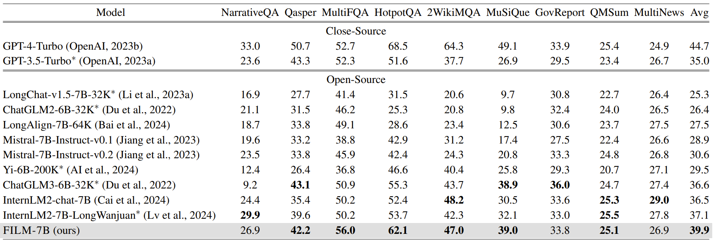
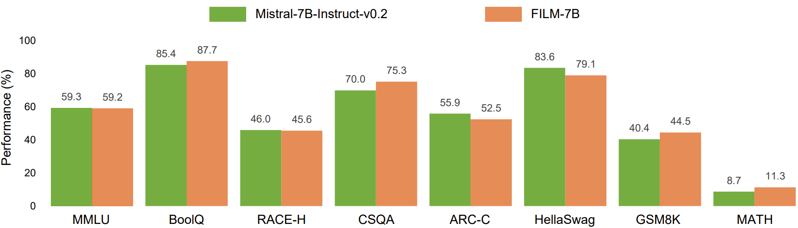

# FILM: Make Your LLM Fully Utilize the Context

<p align="center">
   🤗 <a href="https://huggingface.co/In2Training/FILM-7B" target="_blank">[Model]</a> • 📃 <a href="https://arxiv.org/abs/xxx" target="_blank">[Paper]</a> • ⚓ <a href="https://huggingface.co/datasets/In2Training/VaLProbing-32K" target="_blank">[VaLProbing-32K]</a>
</p>

This is the official repo for the paper *Make Your LLM Fully Utilize the Context*.
This repo can help you to reproduce the results of **FILM-7B, a 32K-context LLM that overcomes the lost-in-the-middle problem**.
FILM-7B is trained from Mistral-7B-Instruct-v0.2 by applying Information-Intensie (In2) Training.
FILM-7B achieves near-perfect performance on probing tasks, SOTA-level performance on real-world long-context tasks among ~7B size LLMs, and does not compromise the short-context performance.


## Setup

We recommend using [Conda](https://docs.conda.io/projects/miniconda) or the official [Pytorch Docker](https://hub.docker.com/layers/pytorch/pytorch/2.0.1-cuda11.7-cudnn8-devel/images/sha256-4f66166dd757752a6a6a9284686b4078e92337cd9d12d2e14d2d46274dfa9048?context=explore) to build up the environment.

```sh
git clone https://github.com/microsoft/FILM.git
cd FILM
conda create -n FILM python=3.10.11
conda activate FILM
pip install torch==2.0.1 # cuda11.7 and cudnn8
pip install -r requirements.txt
```

## Model Usage

The system tempelate for FILM-7B:
```text
[INST] Below is a context and an instruction. Based on the information provided in the context, write a response for the instruction.

### Context:
{YOUR LONG CONTEXT}

### Instruction:
{YOUR QUESTION & INSTRUCTION} [/INST]
```

## Probing Results

To reproduce the results on our VaL Probing, see the guidance in [VaLProbing](./VaLProbing).

<p align="center">
    
    <br>
</p>

## Real-World Long-Context Tasks

To reproduce the results on real-world long-context tasks, see the guidance in [real_world_long](./real_world_long).

<p align="center">
    
    <br>
</p>

## Short-Context Tasks

To reproduce the results on short-context tasks, see the guidance in [short_tasks](./short_tasks).

<p align="center">
    
    <br>
</p>

## Contributing

This project welcomes contributions and suggestions.  Most contributions require you to agree to a
Contributor License Agreement (CLA) declaring that you have the right to, and actually do, grant us
the rights to use your contribution. For details, visit https://cla.opensource.microsoft.com.

When you submit a pull request, a CLA bot will automatically determine whether you need to provide
a CLA and decorate the PR appropriately (e.g., status check, comment). Simply follow the instructions
provided by the bot. You will only need to do this once across all repos using our CLA.

This project has adopted the [Microsoft Open Source Code of Conduct](https://opensource.microsoft.com/codeofconduct/).
For more information see the [Code of Conduct FAQ](https://opensource.microsoft.com/codeofconduct/faq/) or
contact [opencode@microsoft.com](mailto:opencode@microsoft.com) with any additional questions or comments.


